# 🎓 PL/SQL FINAL EXAM – SUPPLIER PERFORMANCE MONITOR SYSTEM

## 👤 Identification
- **Name:** Chela Kaliza  
- **Student ID:** 27800  
- **Project Title:** Supplier Performance Monitor System  
- **Course:** INSY 8311 – Database Development with PL/SQL  
- **Academic Year:** 2024–2025  
- **Lecturer:** Eric Maniraguha (eric.maniraguha@auca.ac.rw)  

---

# 🚀 Phase I: Problem Statement & Presentation

## 📌 Objective
To identify a real-world operational problem that requires an **Oracle PL/SQL database solution**.  
The Supplier Performance Monitor system evaluates supplier delivery behavior by analyzing quality, timeliness, and accuracy.

---

# 💡 Project Summary: Supplier Performance Monitor

## 📖 Problem Definition
Many organizations struggle to maintain reliable supplier relationships because:
- Deliveries are often **late**
- Items may be **incorrect or inaccurate**
- Product **quality** is inconsistent
- There is **no automated scoring or alert mechanism**
- Monitoring happens manually, creating delays and errors  

These issues negatively affect production cycles, inventory planning, and overall supply chain efficiency.

---

## 🌍 Context
This system is useful for:
- Procurement Departments  
- Warehouses  
- Manufacturing Firms  
- Retail Distribution Centers  

It automates supplier evaluation and ensures objective, analytics-based procurement decision-making.

---

## 🎯 Target Users
- Procurement Managers  
- Warehouse Supervisors  
- Supply Chain Analysts  
- Business Executives  

---

## 🏆 Project Goals
- 📊 Evaluate supplier performance using automated scoring  
- 📨 Generate alerts for underperformers  
- 🧮 Track delivery accuracy, timeliness, and quality  
- 🔁 Maintain historical supplier ratings  
- 📘 Improve procurement decision-making via MIS  

---

# 🧩 Key Database Entities (Using Project Tables)

| Entity | Attributes |
|--------|------------|
| **Suppliers** | `supplier_id`, `supplier_name`, `contact_info` |
| **Deliveries** | `delivery_id`, `supplier_id`, `expected_date`, `delivered_date`, `quality_score`, `delivered_correct` |
| **Supplier_Ratings** | `rating_id`, `supplier_id`, `average_score`, `rating_status`, `last_updated` |
| **Supplier_Alerts** | `alert_id`, `supplier_id`, `alert_type`, `alert_details`, `alert_time` |

### 🔗 Relationships
- One **Supplier** → many **Deliveries**  
- Deliveries feed into **Supplier_Ratings**  
- Low ratings generate **Supplier_Alerts**  

---

# 💎 System Benefits
✅ Fully automated performance scoring  
✅ Removes manual evaluation errors  
✅ Real-time alerts for risk mitigation  
✅ Higher transparency and accountability  
✅ Reliable analytics for decision-making  

---

# 📊 Mermaid Diagram (Based on Your Schema)

```mermaid
flowchart TD

A[🧑 Procurement Manager<br/>Monitors Supplier Performance] -->|Registers Supplier| B[📇 Suppliers]

B -->|Makes Deliveries| C[🚚 Deliveries]

C -->|Generates Metrics| D[(📊 Supplier_Ratings)]
D -->|Evaluate Score| E{{Is Performance Acceptable?}}

E -- No --> F[⚠️ Create Alert<br/>Supplier_Alerts]
E -- Yes --> G[✅ No Action Needed]

F --> H[📩 Notify Manager]

classDef actor fill:#e3f2fd,stroke:#2196f3,stroke-width:2px;
classDef data fill:#fff3e0,stroke:#fb8c00,stroke-width:2px;
classDef system fill:#fce4ec,stroke:#d81b60,stroke-width:2px;

class A,H actor
class B,C,D data
class E,F,G system
```


# 📘 Phase II – Business Process Modeling  
### Supplier Performance Monitor (PL/SQL Capstone Project)

## 🔍 1. Scope & Purpose  
This phase models the **supplier performance evaluation workflow**, showing how delivery data is captured, processed, scored, and monitored.  
The goal is to demonstrate how the Supplier Performance Monitor functions as an **MIS**, enabling automated performance scoring and alert generation for decision-making in procurement.

---

## 👥 2. Key Actors

| Actor                     | Description |
|---------------------------|-------------|
| **Procurement Officer**   | Records deliveries and manages supplier data |
| **Supplier**              | Provides shipment and delivery information |
| **PL/SQL Scoring Engine** | Calculates timeliness, quality, and accuracy scores |
| **Performance Evaluator** | Updates supplier rating records |
| **Alert System**          | Generates alerts for low-performing suppliers |

---

## 🧩 3. Business Process Description  
1. The **Procurement Officer** records new delivery information for a supplier.  
2. The supplier’s data (expected date, delivered date, quality score, accuracy) is forwarded to the **PL/SQL Scoring Engine**.  
3. The scoring engine computes the supplier’s performance score based on timeliness, accuracy, and quality.  
4. The system updates the **supplier_ratings** table with the new average score.  
5. The rating is evaluated against the performance threshold.  
6. If the score is below the required level, the **Alert System** logs an alert in the `supplier_alerts` table.  
7. The process ends once scores are updated and alerts (if needed) are generated.

This supports MIS by providing real-time monitoring, automated scoring, and performance alerts to guide procurement decisions.

---

## 🖼 4. Process Diagram (Mermaid)


  ## 🧩 BPMN Diagram – Supplier Performance Monitor


## 🎯 5. MIS Value Summary  
1. The system provides **real-time monitoring** by updating supplier performance immediately after each recorded delivery.  
2. MIS automation increases **operational efficiency** by reducing manual scoring and minimizing human error through PL/SQL procedures.  
3. Procurement teams can make **data-driven decisions** by identifying high-performing and underperforming suppliers through consistent evaluation.  
4. Automatic alerts enable **quick response to performance issues**, ensuring low-performing suppliers are addressed promptly.  
5. All performance data is stored centrally, ensuring **consistent and accurate information flow** that supports BI dashboards and long-term procurement analysis.

# 🧩 Phase III: Logical Model Design  
### Supplier Performance Monitor (PL/SQL Capstone Project)

## 🎯 Objective  
The goal of this phase is to design a **normalized, relational, and constraint-enforced logical data model** for the Supplier Performance Monitor System.  
This model is based on the real-world needs identified in **Phase I** and the automated workflow designed in **Phase II**, ensuring accurate representation of supplier deliveries, performance scoring, and alert generation.

---

## 🗃️ Entities & Attributes  

### 🏢 Suppliers  
| Attribute       | Type           | Constraint                        |
|-----------------|----------------|-----------------------------------|
| Supplier_ID     | NUMBER         | Primary Key (Auto-generated)       |
| Supplier_Name   | VARCHAR2(150)  | NOT NULL                          |
| Contact_Info    | VARCHAR2(200)  | UNIQUE                            |
| Created_At      | DATE           | DEFAULT SYSDATE                   |

---

### 📦 Deliveries  
| Attribute        | Type      | Constraint                                   |
|------------------|-----------|-----------------------------------------------|
| Delivery_ID      | NUMBER    | Primary Key (Auto-generated)                 |
| Supplier_ID      | NUMBER    | Foreign Key → Suppliers                      |
| Expected_Date    | DATE      | NOT NULL                                     |
| Delivered_Date   | DATE      | NOT NULL                                     |
| Quality_Score    | NUMBER    | CHECK (Quality_Score BETWEEN 1 AND 100)      |
| Delivered_Correct| CHAR(1)   | CHECK (Delivered_Correct IN ('Y','N'))       |

---

### ⭐ Supplier_Ratings  
| Attribute      | Type         | Constraint                                   |
|----------------|--------------|-----------------------------------------------|
| Rating_ID      | NUMBER       | Primary Key (Auto-generated)                  |
| Supplier_ID    | NUMBER       | Foreign Key → Suppliers                       |
| Average_Score  | NUMBER       | CHECK (Average_Score BETWEEN 0 AND 100)       |
| Rating_Status  | VARCHAR2(20) | NOT NULL                                      |
| Last_Updated   | DATE         | DEFAULT SYSDATE                               |

---

### 🚨 Supplier_Alerts  
| Attribute      | Type          | Constraint                                   |
|----------------|---------------|-----------------------------------------------|
| Alert_ID       | NUMBER        | Primary Key (Auto-generated)                  |
| Supplier_ID    | NUMBER        | Foreign Key → Suppliers                       |
| Alert_Type     | VARCHAR2(100) | NOT NULL                                      |
| Alert_Details  | VARCHAR2(500) | NOT NULL                                      |
| Alert_Time     | DATE          | DEFAULT SYSDATE                               |

---

## 🔄 Relationships & Constraints  

- 🧩 **Suppliers → Deliveries** — *One-to-Many*  
- 📊 **Suppliers → Supplier_Ratings** — *One-to-One* (each supplier has one rating summary)  
- 🚨 **Suppliers → Supplier_Alerts** — *One-to-Many*  
- 🔗 **Foreign Keys** enforce relational integrity  
- 🔍 **CHECK constraints** ensure valid data values  
- ♻️ **Sychronized updates** ensure the scoring engine maintains consistent ratings  

---

## 📐 Normalization (3NF Verified)

- ✅ **1NF:** All fields contain atomic values  
- ✅ **2NF:** Every attribute is fully dependent on the primary key  
- ✅ **3NF:** No transitive dependencies; derived data lives only in Supplier_Ratings  

---

## 🖼️ ERD Diagram

> 🟩 **Visual Placeholder: Logical Data Model ERD**  
> The following diagrams represent all entities, primary keys, foreign keys, and relationships.


---


---

# 🏗️ Phase IV: Database Creation and Access Setup (via SQL Developer)
### Supplier Performance Monitor (PL/SQL Capstone Project)

---

## 🎯 Objective  
To create a dedicated Oracle PL/SQL development environment for the **Supplier Performance Monitor System** using **SQL Developer** as an alternative to Oracle Enterprise Manager (OEM).  
This setup enables secure access, database object creation, and prepares the workspace for Phase V (table implementation).

---

## 🔐 Task 1: PDB and User Creation (SQL Developer)

The project environment was configured inside an Oracle **Pluggable Database (PDB)** using SQL Developer.  
SQL Developer provides a graphical interface for database administration, user creation, and privilege management without relying on OEM.

---

## 🧰 Configuration Summary

| Component             | Value                                         |
|-----------------------|-----------------------------------------------|
| **Tool Used**         | SQL Developer (OEM Alternative)               |
| **PDB Name**          | `wed_27443_cedrick_Supplier_db`               |
| **User Created**      | `cedrick27443`                                |
| **Password**          | `cedrick`                                     |
| **Privileges Granted**| Full DBA privileges                           |

---

## 📸 Screenshot: PDB Creation in SQL Developer  


---

## 📸 Screenshot: User Created & Privileges Granted  


---

## 🔧 SQL Commands Executed (SQLPlus)

```sql
-- Switch to the project PDB
ALTER SESSION SET CONTAINER=wed_27443_cedrick_Supplier_db;

-- Create project user
CREATE USER cedrick27443 IDENTIFIED BY cedrick;

-- Grant database privileges
GRANT ALL PRIVILEGES TO cedrick27443;
GRANT SYSDBA TO cedrick27443;
```
# 🧱 Phase V: Table Implementation and Data Insertion  
### Supplier Performance Monitor (PL/SQL Capstone Project)

---

## 🎯 Objective  
To implement the physical Oracle database structure for the Supplier Performance Monitor system and insert meaningful test data.  
This phase ensures data integrity, correct constraints, and realistic supplier, delivery, rating, and alert information to support future PL/SQL scoring and alerting logic.

---

## 🔨 Step 1: Table Creation  

✅ The following tables were created in the schema `wed_27443_cedrick_Supplier_db` using SQL Developer:

---

### 🧱 Table: Suppliers  


---

### 🧱 Table: Deliveries  


---

### 🧱 Table: Supplier_Ratings  


---

### 🧱 Table: Supplier_Alerts  


---

## 📥 Step 2: Data Insertion  

Realistic and meaningful test data was inserted into each table to represent real supplier performance scenarios such as late deliveries, incorrect items, and low quality scores.

---

### 🗃️ Insertion: Suppliers  


---

### 🗃️ Insertion: Deliveries  


---

### 🗃️ Insertion: Supplier_Ratings  


---

### 🗃️ Insertion: Supplier_Alerts  


---

## 🔍 Step 3: Data Integrity Validation  

A set of join queries were executed to validate table relationships and ensure referential integrity across the system.

> ✅ Validation confirmed:
- All foreign keys are valid  
- Supplier–delivery–rating relationships work correctly  
- Alerts correctly reference suppliers with low performance  
- Data follows the logical workflow from Phase II  


---

#  Phase VI: PL/SQL Programming (Procedures, Functions, Cursors, Triggers, Packages)
### Supplier Performance Monitor (PL/SQL Capstone Project)

---

##  Objective  
To implement core business logic of the **Supplier Performance Monitor System** using PL/SQL.  
This phase automates supplier scoring, evaluates delivery performance, updates ratings, and generates alerts for underperforming suppliers through PL/SQL **procedures, functions, cursors, triggers, and packages**.

---

# 🧱 Database Operations

## 🔁 DML Operations  
- `INSERT`, `UPDATE`, `DELETE` operations were used to manipulate **deliveries**, **ratings**, and **alerts**.  
- Example operations included:  
  - Inserting new delivery records  
  - Updating supplier performance scores  
  - Deleting test logs during development  


---

## 🧩 DDL Operations  
- Applied `CREATE`, `ALTER`, and `DROP` commands during testing to refine structures.  
- Example changes:  
  - Adding `Last_Updated` to `supplier_ratings`  
  - Updating CHECK constraints for accuracy fields  


---

# 💡 Simple Analytics Problem Statement

> “Evaluate which suppliers frequently deliver late or provide poor quality, helping identify low-performing vendors.”

A **Window Function** was used to analyze supplier delivery performance trends.

```sql
SELECT 
    supplier_id,
    delivered_date,
    expected_date,
    quality_score,
    delivered_correct,
    COUNT(delivery_id) OVER (PARTITION BY supplier_
```
# 🧠 Phase VII: Advanced Database Programming and Auditing
### Supplier Performance Monitor (PL/SQL Capstone Project)

---

## 🎯 Objective

To secure the Supplier Performance Monitor system by implementing advanced database-level controls.  
This phase introduces:

- Trigger-based protection
- Holiday and weekday restrictions
- Centralized auditing
- Package-driven logging logic

These ensure **governance**, **traceability**, and **MIS-level accountability** for all delivery and rating operations.

---

## 🔍 Problem Statement

Supplier performance data is sensitive and must remain accurate.  
Unauthorized edits can create faulty evaluations and misleading MIS reports.

The system therefore enforces:

- ❌ DML blocking during protected days  
- 🕵️ Full audit logs for all attempts  
- 🧩 Package-based logic for clean and reusable auditing workflows  

---

## 📅 Holiday Restriction System

### 📘 Holiday Calendar Table  
A dedicated holiday table is maintained to mark days when supplier performance data cannot be changed.


This ensures no performance data is modified during sensitive or closed business dates.

---

## 🧨 Trigger-Based Restriction Logic

### 🔒 Weekday & Holiday Protection  
A trigger automatically blocks inserts, updates, or deletes on supplier performance tables during:

- Monday → Friday  
- Any defined holiday  


If a user attempts a modification during restricted periods, the system raises an error and logs the attempt.

---

## 🕵️ Auditing System

### 🗂️ Audit Log Table  
A centralized audit table captures:

- Username  
- Date and time  
- Operation performed  
- Table affected  
- Status (Allowed / Denied)  
- Remarks summarizing the action  


This table supports MIS reporting, accountability, and security analysis.

---

## 🔄 Trigger + Audit Integration

Every action on the deliveries table is monitored using a second trigger that:

1. Determines if the action is allowed  
2. Logs the attempt through the audit package  
3. Blocks or allows the action accordingly  


This ensures **every attempt** — approved or denied — is recorded.

---

## 📦 `audit_pkg` – Centralized Logging Package

A PL/SQL package is used to centralize audit logic.  
This improves:

- Consistency in logging  
- Reusability  
- Maintainability  


---

## 🧪 Testing & Evidence

### ✔️ 1. Manual Logging  
A manual audit entry test confirms the package works independently.


---

### ❌ 2. Denied Insert Attempt  
An insert performed on a restricted day triggers a denial and logs the failed action.


---

### 🔍 3. Viewing Audit History  
Querying the audit log displays all actions, filtered by user or date.


---

### ❌ 4. Denied Update & Delete  
Update/delete attempts during a restricted period are rejected and logged as DENIED.


---

## 📁 Full SQL Script  
All SQL scripts for Phase VII are available in:  
`./WED_27443_SPM.sql`

---

     


