# 🎓 PL/SQL FINAL EXAM – SUPPLIER PERFORMANCE MONITOR SYSTEM

## 👤 Identification
- **Name:** Chela Kaliza  
- **Student ID:** 27800  
- **Project Title:** Supplier Performance Monitor System  
- **Course:** INSY 8311 – Database Development with PL/SQL  
- **Academic Year:** 2024–2025  
- **Lecturer:** Eric Maniraguha (eric.maniraguha@auca.ac.rw)  

---

# 🚀 Phase I: Problem Statement & Presentation

## 📌 Objective
To identify a real-world operational problem that requires an **Oracle PL/SQL database solution**.  
The Supplier Performance Monitor system evaluates supplier delivery behavior by analyzing quality, timeliness, and accuracy.

---

# 💡 Project Summary: Supplier Performance Monitor

## 📖 Problem Definition
Many organizations struggle to maintain reliable supplier relationships because:
- Deliveries are often **late**
- Items may be **incorrect or inaccurate**
- Product **quality** is inconsistent
- There is **no automated scoring or alert mechanism**
- Monitoring happens manually, creating delays and errors  

These issues negatively affect production cycles, inventory planning, and overall supply chain efficiency.

---

## 🌍 Context
This system is useful for:
- Procurement Departments  
- Warehouses  
- Manufacturing Firms  
- Retail Distribution Centers  

It automates supplier evaluation and ensures objective, analytics-based procurement decision-making.

---

## 🎯 Target Users
- Procurement Managers  
- Warehouse Supervisors  
- Supply Chain Analysts  
- Business Executives  

---

## 🏆 Project Goals
- 📊 Evaluate supplier performance using automated scoring  
- 📨 Generate alerts for underperformers  
- 🧮 Track delivery accuracy, timeliness, and quality  
- 🔁 Maintain historical supplier ratings  
- 📘 Improve procurement decision-making via MIS  

---

# 🧩 Key Database Entities (Using Project Tables)

| Entity | Attributes |
|--------|------------|
| **Suppliers** | `supplier_id`, `supplier_name`, `contact_info` |
| **Deliveries** | `delivery_id`, `supplier_id`, `expected_date`, `delivered_date`, `quality_score`, `delivered_correct` |
| **Supplier_Ratings** | `rating_id`, `supplier_id`, `average_score`, `rating_status`, `last_updated` |
| **Supplier_Alerts** | `alert_id`, `supplier_id`, `alert_type`, `alert_details`, `alert_time` |

### 🔗 Relationships
- One **Supplier** → many **Deliveries**  
- Deliveries feed into **Supplier_Ratings**  
- Low ratings generate **Supplier_Alerts**  

---

# 💎 System Benefits
✅ Fully automated performance scoring  
✅ Removes manual evaluation errors  
✅ Real-time alerts for risk mitigation  
✅ Higher transparency and accountability  
✅ Reliable analytics for decision-making  

---

# 📊 Mermaid Diagram (Based on Your Schema)

```mermaid
flowchart TD

A[🧑 Procurement Manager<br/>Monitors Supplier Performance] -->|Registers Supplier| B[📇 Suppliers]

B -->|Makes Deliveries| C[🚚 Deliveries]

C -->|Generates Metrics| D[(📊 Supplier_Ratings)]
D -->|Evaluate Score| E{{Is Performance Acceptable?}}

E -- No --> F[⚠️ Create Alert<br/>Supplier_Alerts]
E -- Yes --> G[✅ No Action Needed]

F --> H[📩 Notify Manager]

classDef actor fill:#e3f2fd,stroke:#2196f3,stroke-width:2px;
classDef data fill:#fff3e0,stroke:#fb8c00,stroke-width:2px;
classDef system fill:#fce4ec,stroke:#d81b60,stroke-width:2px;

class A,H actor
class B,C,D data
class E,F,G system
```

# 📘 Phase II – Business Process Modeling  
### Supplier Performance Monitor (PL/SQL Capstone Project)

## 🔍 1. Scope & Purpose  
This phase models the **supplier performance evaluation workflow**, showing how delivery data is captured, processed, scored, and monitored.  
The goal is to demonstrate how the Supplier Performance Monitor functions as an **MIS**, enabling automated performance scoring and alert generation for decision-making in procurement.

---

## 👥 2. Key Actors

| Actor                     | Description |
|---------------------------|-------------|
| **Procurement Officer**   | Records deliveries and manages supplier data |
| **Supplier**              | Provides shipment and delivery information |
| **PL/SQL Scoring Engine** | Calculates timeliness, quality, and accuracy scores |
| **Performance Evaluator** | Updates supplier rating records |
| **Alert System**          | Generates alerts for low-performing suppliers |

---

## 🧩 3. Business Process Description  
1. The **Procurement Officer** records new delivery information for a supplier.  
2. The supplier’s data (expected date, delivered date, quality score, accuracy) is forwarded to the **PL/SQL Scoring Engine**.  
3. The scoring engine computes the supplier’s performance score based on timeliness, accuracy, and quality.  
4. The system updates the **supplier_ratings** table with the new average score.  
5. The rating is evaluated against the performance threshold.  
6. If the score is below the required level, the **Alert System** logs an alert in the `supplier_alerts` table.  
7. The process ends once scores are updated and alerts (if needed) are generated.

This supports MIS by providing real-time monitoring, automated scoring, and performance alerts to guide procurement decisions.

---

## 🖼 4. Process Diagram (Mermaid)

```mermaid
flowchart TD
  start([● Process Start]) --> A1["🧑 Procurement Officer<br>Record Delivery Data"]
  A1 --> A2["📦 Delivery Received"]
  A2 --> B1["🚚 Supplier Provides Shipment Info"]

  B1 --> C1["🧮 PL/SQL Scoring Engine<br>Calculate Performance Score"]
  C1 --> A3["📊 Update Supplier_Ratings Table"]

  A3 --> D1{{"🔍 Score < Threshold?"}}
  D1 -- Yes --> E1["❗ Generate Alert in Supplier_Alerts Table"]
  D1 -- No --> finish([✅ Process End])
  E1 --> finish

  classDef officer fill:#f9f,stroke:#333;
  classDef supplier fill:#bbf,stroke:#333;
  classDef system fill:#f96,stroke:#333;

  class A1 officer
  class B1 supplier
  class C1,A3,D1,E1 system
```

## 🎯 5. MIS Value Summary  
1. The system provides **real-time monitoring** by updating supplier performance immediately after each recorded delivery.  
2. MIS automation increases **operational efficiency** by reducing manual scoring and minimizing human error through PL/SQL procedures.  
3. Procurement teams can make **data-driven decisions** by identifying high-performing and underperforming suppliers through consistent evaluation.  
4. Automatic alerts enable **quick response to performance issues**, ensuring low-performing suppliers are addressed promptly.  
5. All performance data is stored centrally, ensuring **consistent and accurate information flow** that supports BI dashboards and long-term procurement analysis.

